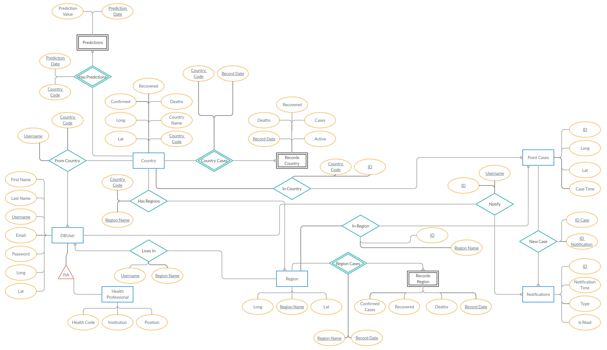

# Database

## Diagrama ER



## Entidades e Relações

Para satisfazer as necessidades da aplicação e a partir do diagrama ER acima, listem-se agora as entidades e relações e as suas respectivas restrições aos dados.

### Entidades

#### DBUser

A entidade utilizador DBUser que, como o nome indica, representará o utilizador, necessitará dos campos abaixo listados.

```sql
CREATE TABLE DBUser (

    first_name varchar(32) not null,
    last_name varchar(32) not null,
    username varchar(32) not null,
    email text unique not null,
    long decimal not null,
    lat decimal not null,
    password char(60) not null,
    role char(1) not null,

    PRIMARY KEY (username)
);
```

É de destacar que a chave primária é **username**, e que o campo de **email** é único.

#### HealthProfessional

Para representar os utilizadores que são profissionais de saúde, utilizam-se os seguintes campos.

```sql
CREATE TYPE medical_role AS ENUM ('doctor', 'nurse', 'other');

CREATE TABLE HealthProfissional (

    health_code char(9),
    institution text,
    position medical_role not null,
    username varchar(32),

    PRIMARY KEY (health_code, username),
    FOREIGN KEY (username) REFERENCES DBUser(username)
);
```

Esta entidade é fraca, tal como explicitado no diagrama ER, e é identificada pelo campo **health\_code**. No entanto, só existe uma entrada nesta tabela se também existir uma entrada correspondente na tabela **DBUser**, pelo que, em vez de utilizar uma relação para estabelecer a correspondência, optou-se por "integrar" o campo **username** nesta entidade. 

#### Country

Entidade que representa um país e mantém os últimos valores dos indicadores do país.

```sql
CREATE TABLE Country (

    country_code char(2),
    country_name varchar(32),
    confirmed integer,
    deaths integer,
    recovered integer,
    lat decimal, 
    long decimal,

    PRIMARY KEY (country_code)
);
```

#### RecordsCountry

Entidade que representa os registos com a evolução dos indicadores do país que lhe corresponde.

```sql
CREATE TABLE RecordsCountry (

    country_code char(2),
    record_date timestamp,
    recovered integer,
    deaths integer,
    cases integer,
    active integer, 

    FOREIGN KEY (country_code) REFERENCES Country(country_code),
    PRIMARY KEY (country_code, record_date)
);
```

Da mesma forma que a entidade **HealthProfessional**, está é também uma entidade fraca. Igualmente, uma entrada nesta tabela só pode existir se existir o país que lhe corresponde, pelo que não é necessário manter uma relação para estabelecer a correspondência.

#### Region

Entidade que representa uma região. É mantido o seu nome e a sua posição. É estabelecida uma relação com a entidade **Country** de maneira a associar cada país às suas regiões.

```sql
CREATE TABLE Region (

    region_name varchar(32),
    long decimal,
    lat decimal,

    PRIMARY KEY (region_name)
);
```

#### RecordsRegion

Entidade que mantém os registos da evolução dos indicadores de uma região.

```sql
CREATE TABLE RecordsRegion (

    region_name varchar(32),
    record_date timestamp,
    confirmed_cases integer,
    recovered integer,
    deaths integer,

    FOREIGN KEY (region_name) REFERENCES Region(region_name),
    PRIMARY KEY (region_name, record_date)
);
```

Tal como as entidades **RecordsCountry** e **HealthProfessional**, também esta é uma entidade fraca. Pelas mesmas razões citadas anteriormente, não é mantida uma relação entre **Region** e **RecordsRegion**.

#### PointCases

Entidade que representa um caso individual adicionada por um profissional de saúde, que servirá para alertar os utilizadores perto do local em que foi detectado.

```sql
CREATE TABLE PointCases (

    ID serial,
    long decimal,
    lat decimal,
    case_time timestamp,

    PRIMARY KEY (id)
);
```

#### Notifications

Entidade que representa uma notificação para um utilizador no caso de ter surgido um novo caso perto do mesmo.

```sql
CREATE TABLE Notifications (

    ID serial,
    notification_time timestamp,
    is_read boolean,

    PRIMARY KEY (id)
);
```

#### Predictions

Entidade que mantém as previsões até sete dias para os casos activos de cada país.

```sql
CREATE TABLE Predictions (

    prediction_date timestamp,
    prediction_value integer,
    country_code char(2),

    PRIMARY KEY (country_code, prediction_date),
    FOREIGN KEY (country_code) REFERENCES Country(country_code)
);
```

Esta é também uma entidade fraca, e pelo mesmo argumento fornecido para as restantes entidades fracas, não é necessário manter uma relação entre **Country** e **Predictions**.

### Relações

#### NewCase

Relação que estabelece ligação entre um novo caso individual 

```sql
CREATE TABLE NewCase (

    not_id integer,
    case_id integer,

    FOREIGN KEY (not_id) REFERENCES Notifications(ID),
    FOREIGN KEY (case_id) REFERENCES PointCases(ID),

    PRIMARY KEY (not_id, case_id)
);
```

#### Notify

Relação que estabelece ligação entre uma notificação e o utilizador notificado.

```sql
CREATE TABLE Notify (

    not_id integer,
    username varchar(32),

    FOREIGN KEY (not_id) REFERENCES Notifications(ID),
    FOREIGN KEY (username) REFERENCES DBUser(username),

    PRIMARY KEY (not_id, username)
);
```

#### HasRegions

Relação que indica quais as regiões de um país.

```sql
CREATE TABLE HasRegions (

    country_code char(2),
    region_name varchar(32),

    FOREIGN KEY (country_code) REFERENCES Country(country_code),
    FOREIGN KEY (region_name) REFERENCES Region(region_name),

    PRIMARY KEY (country_code, region_name)
);
```

#### **FromCountry**

Relação que estabelece a ligação entre um utilizador e o seu país de residência.

```sql
CREATE TABLE FromCountry (

    username varchar(32),
    country_code char(2),

    FOREIGN KEY (username) REFERENCES DBUser(username),
    FOREIGN KEY (country_code) REFERENCES Country(country_code),

    PRIMARY KEY (username, country_code)
);
```

#### **LivesIn**

Relação que indica qual a região em que o utilizador vive, se a relação existir no sistema. 

```sql
CREATE TABLE LivesIn (

    username varchar(32),
    region_name varchar(32),

    FOREIGN KEY (username) REFERENCES DBUser(username),
    FOREIGN KEY (region_name) REFERENCES Region(region_name),

    PRIMARY KEY (username, region_name)
);
```

#### **InCountry**

Relação que indica os casos individuais detectados num país.

```sql
CREATE TABLE InCountry (

    ID integer,
    country_code char(2),

    FOREIGN KEY (ID) REFERENCES PointCases(ID),
    FOREIGN KEY (country_code) REFERENCES Country(country_code),

    PRIMARY KEY (ID, country_code)
);
```

#### **InRegion**

Relação que indica os casos individuais detectados numa região.

```sql
CREATE TABLE InRegion (

    ID integer,
    region_name varchar(32),

    FOREIGN KEY (ID) REFERENCES PointCases(ID),
    FOREIGN KEY (region_name) REFERENCES Region(region_name),

    PRIMARY KEY (ID, region_name)
);
```

## Triggers

Para a execução das funcionalidades:

* Actualizar as previsões aquando da inserção de novos dados.
* Notificar utilizadores sobre novos casos perto de si.

Serão executados triggers que permitem a cadeia de execução associada às respectivas funcionalidades. No entanto, esses triggers são registados pelo servidor, assim serão discutidos nessa secção.



## Update dos Dados

O update dos dados é feito periodicamente por um serviço de scheduling do servidor. Fornecendo mais algum detalhe:

* O update do registos dos países é feito de 12 em 12 horas, através de um pedido REST à API [**COVID19 API**](https://covid19api.com/).
* O update dos indicadores dos países é feito de 12 em 12 horas utilizando o mesmo mecanismo REST acima mencionado, com a mesma API.
* O update das regiões portuguesas é conseguido por um pedido REST à API [**COVID-19 REST API Portugal**](https://covid19-api.vost.pt/) ****e é realizado à 1 da manhã de cada dia.

Uma discussão mais detalhada pode ser encontrada em:



