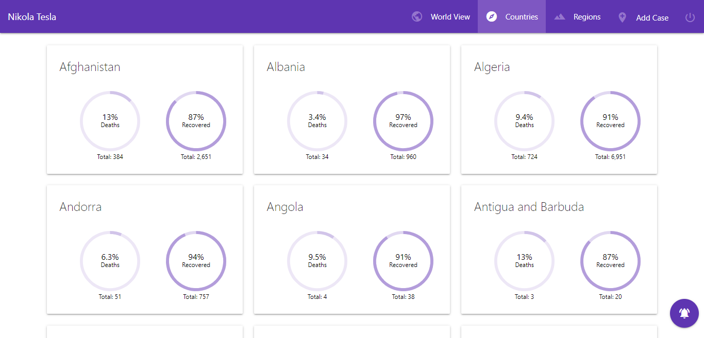
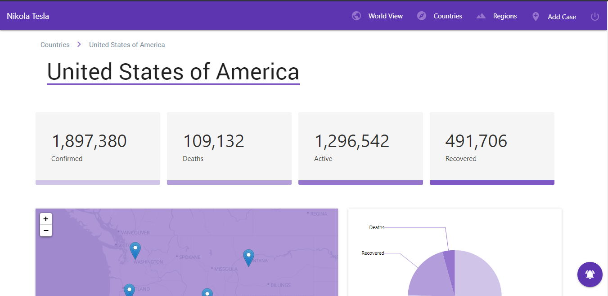
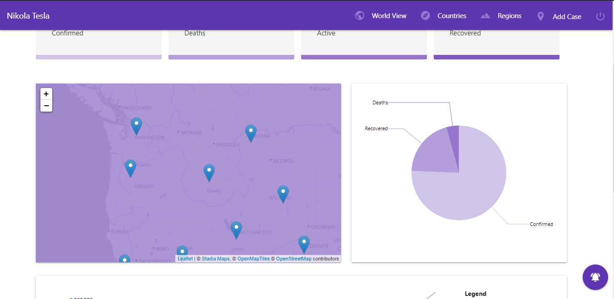

# Countries

A partir da home page podemos navegar para a página que mostra todos os países. Aqui podemos ter uma breve ideia da evolução dos casos através dos gráficos disponibilizados.

Ao premir um dos países somos levados a uma página que nos permite visualizar em detalhe a evolução/proporção dos casos, os valores do último registo e as regiões, caso estejam disponíveis. As regiões apareceram marcadas no mapa junto do país.

