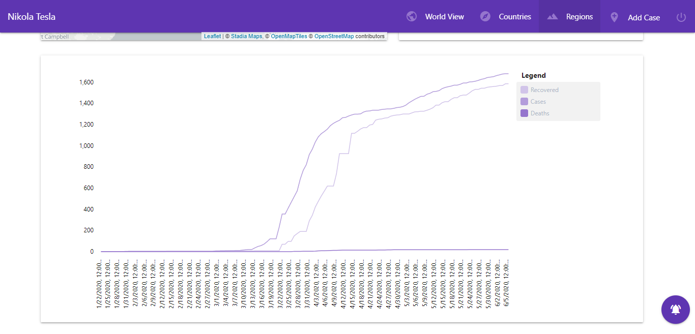

# Regions

Mais uma vez, partindo da home page podemos aceder à lista de regiões disponíveis.

Premindo uma das regiões leva-nos à página com os seus detalhes. Tal como nos países, podemos visualizar a evolução/proporção dos casos e os últimos valores obtidos.

