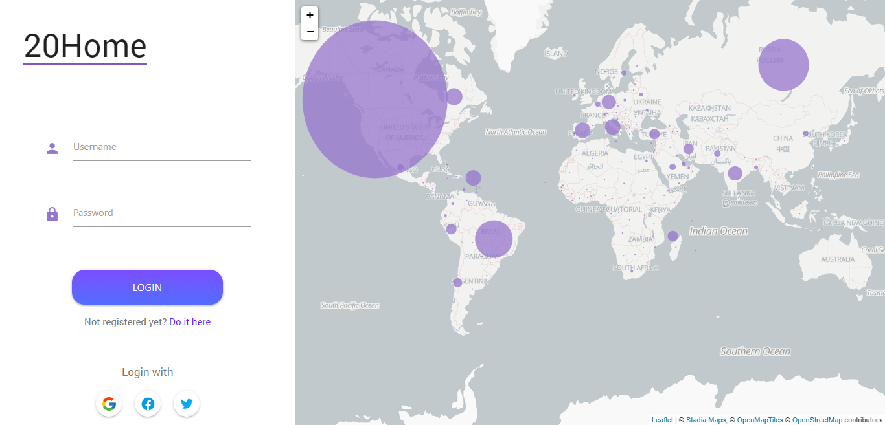

# Landing

A landing page é a primeira página apresentada ao utilizador. Nela podem ser visualizados a distribuição de casos pelo mundo, bem como efectuar o login ou navegar para a página de registo caso ainda não tenha conta.

