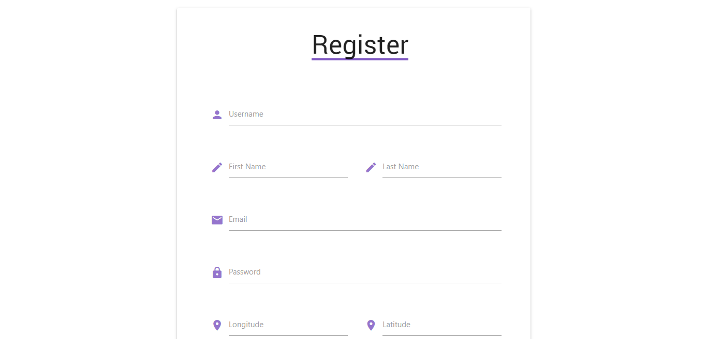
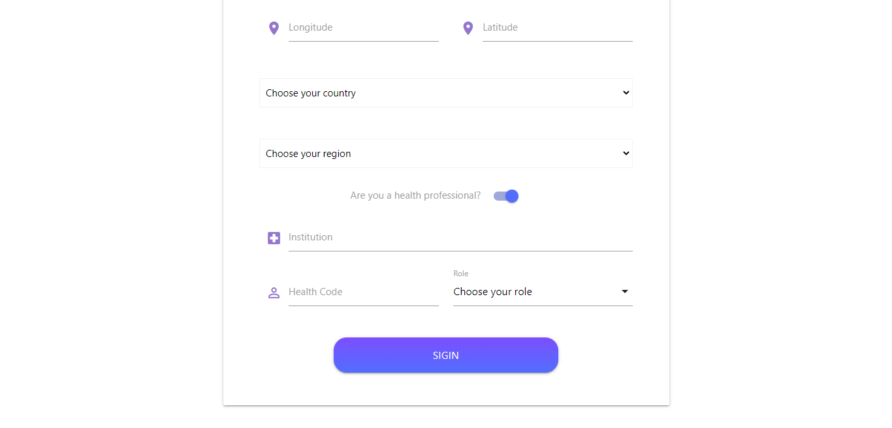

# Register

A página de registo permite que um novo utilizador se registe, expondo os campos necessários para criar a sua conta.

Os utilizadores que são profissionais de saúde têm a opção de preencher os campos que a tal correspondem.

